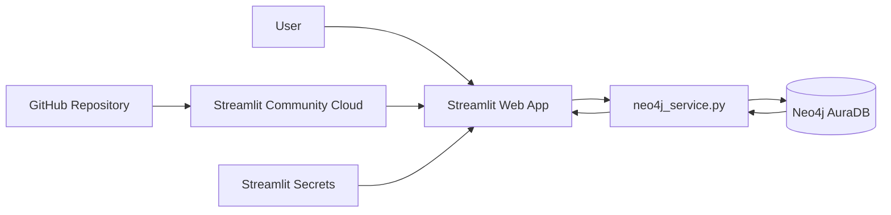
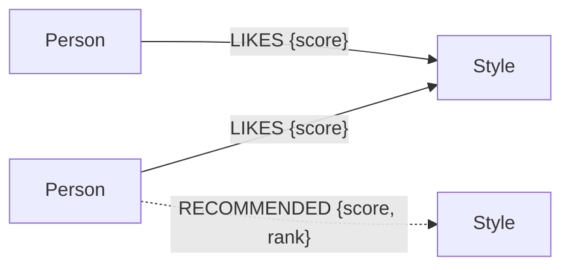

# คู่มือระบบแนะนำทรงผมด้วย Neo4j Aura + Streamlit

## 1) เป้าหมาย

1. ออกแบบ Property Graph จากโจทย์ "คนชอบทรงผม"
2. อธิบาย Node, Label, Property, Relationship และ Direction
3. เขียน Cypher สำหรับเพิ่มข้อมูล, traversal และ aggregation
4. เชื่อม Python กับ Neo4j Aura ด้วย Neo4j Python Driver
5. สร้าง Explainable Recommendation จากความสัมพันธ์ในกราฟ
6. พัฒนา Web UI ด้วย Streamlit และ deploy ขึ้น Streamlit Community Cloud

---

## 2) สถาปัตยกรรมระบบ



- **Presentation layer:** `app.py`
- **Database access layer:** `neo4j_service.py`
- **Graph database:** Neo4j AuraDB
- **Deployment/configuration:** GitHub + Streamlit Community Cloud + Secrets

---

## 3) Graph Data Model



### Node

| Label | Primary property | Property อื่น | หน้าที่ |
|---|---|---|---|
| Person | person_id | name | ผู้ใช้ระบบ (P01–P15) |
| Style | style_id | name, image | ทรงผม (H01–H12), image = ชื่อไฟล์ใน `images/` |

### Relationship

| Relationship | Source → Target | Property | ความหมาย |
|---|---|---|---|
| LIKES | Person → Style | score (1–10) | คนชอบทรงนี้ และชอบมากแค่ไหน |
| RECOMMENDED | Person → Style | score, rank | ผลแนะนำที่บันทึกลงฐานข้อมูล |

> `RECOMMENDED` เป็นข้อมูลที่ "คำนวณมา" ไม่ใช่ข้อมูลจริง จึงลบแล้วสร้างใหม่ทุกครั้งที่กดบันทึก

---

## 4) เหตุผลที่ Graph Database เหมาะกับโจทย์นี้

ในฐานข้อมูลตาราง การหา "ทรงผมที่คนที่ชอบทรงเดียวกับเราชอบ แต่เรายังไม่ชอบ"
ต้อง JOIN ตาราง Likes กับตัวเองหลายรอบ

ใน Graph เขียนเป็น pattern ตรงกับโจทย์เลย

```cypher
MATCH (u:Person {person_id:$person_id})
      -[:LIKES]->(:Style)
      <-[:LIKES]-(other:Person)
      -[:LIKES]->(rec:Style)
WHERE other <> u
  AND NOT EXISTS { (u)-[:LIKES]->(rec) }
RETURN rec
```

---

## 5) Recommendation Algorithm

### Signal 1: Collaborative (คนที่ชอบคล้ายกัน)

จำนวนคน (ไม่นับซ้ำ) ที่ชอบทรงเดียวกับผู้ใช้อย่างน้อย 1 ทรง และชอบทรงที่จะแนะนำ

```text
similar_score = similar_people × 3
```

### Signal 2: Shared styles (ทรงที่เชื่อมมาถึง)

จำนวนทรงที่ผู้ใช้ชอบ ที่มีเส้นทางเชื่อมมาถึงทรงที่จะแนะนำ

```text
shared_score = shared_styles × 2
```

### Signal 3: Popularity

จำนวนคนทั้งระบบที่ชอบทรงนี้

```text
popularity_score = popularity × 0.20
```

### Signal 4: Average score

คะแนนความชอบเฉลี่ยจาก `LIKES.score` (เต็ม 10)

```text
avg_score_score = avg_score × 0.25
```

### Final score

```text
score = similar_score + shared_score + popularity_score + avg_score_score
```

และตัดทรงที่ผู้ใช้ชอบอยู่แล้วออก

```cypher
WHERE NOT EXISTS { (u)-[:LIKES]->(h) }
```

ผู้ใช้ใหม่ที่ยังไม่ชอบทรงไหน (cold start) จะไม่มี signal 1–2 ระบบจึงแนะนำจากความนิยมและคะแนนเฉลี่ยแทน

---

## 6) Explainable Recommendation

ตัวอย่างเหตุผลที่แสดงบนหน้าเว็บ

```text
คนที่ชอบคล้ายคุณ 2 คนชอบทรงนี้ (ญาดา, อริสา)
• เชื่อมมาจากทรงที่คุณชอบ 2 ทรง (ยาวดัดลอน, ดัดโครงสร้าง)
• มีคนชอบทั้งหมด 3 คน
• คะแนนเฉลี่ย 8.67/10
```

ทุกข้อ trace กลับไปหาเส้นทางในกราฟได้ (ดูได้จากหน้า Graph Explorer)

---

## 7) Constraint และ MERGE

```cypher
CREATE CONSTRAINT person_id_unique IF NOT EXISTS
FOR (p:Person) REQUIRE p.person_id IS UNIQUE;
```

```cypher
MERGE (p:Person {person_id: row.person_id})
SET p.name = row.name
```

`MERGE` หาก่อน ถ้าไม่มีค่อยสร้าง จึงกดปุ่มสร้างข้อมูลซ้ำได้ และใช้ร่วมกับข้อมูลที่เคยใส่จาก notebook ได้

---

## 8) Parameterized Cypher

ไม่ควรเขียน

```python
cypher = "MATCH (p:Person {person_id:'" + person_id + "'}) RETURN p"
```

ควรเขียน

```python
cypher = "MATCH (p:Person {person_id:$person_id}) RETURN p"
params = {"person_id": person_id}
```

---

## 9) การเชื่อมต่อ Neo4j Aura

`neo4j_service.py` สร้าง `Driver` ตัวเดียวแล้ว cache ด้วย `@st.cache_resource`

```python
@st.cache_resource(show_spinner=False)
def get_driver():
    driver = GraphDatabase.driver(uri, auth=(username, password))
    driver.verify_connectivity()
    return driver
```

---

## 10) หน้าจอของระบบ

- **Dashboard:** จำนวน Person / Style / LIKES / RECOMMENDED, กราฟทรงผมยอดนิยม, ทรงที่ผู้ใช้ชอบ
- **Recommendations:** เลือกผู้ใช้, กำหนด Top-N, แสดงคะแนนและเหตุผล
- **Style Search:** ค้นหาทรงผมจากชื่อหรือรหัส พร้อมรายชื่อคนที่ชอบ
- **Like / Rate:** บันทึกความชอบพร้อมคะแนน, ยกเลิกความชอบ (เห็นรูปทรงที่เลือก)
- **Manage Data:** เพิ่ม / แก้ไข / ลบ คน, ทรงผม (พร้อมรูป) และความชอบ
- **Graph Explorer:** กราฟรอบตัวผู้ใช้ 2 ทอด (ตัวเอง = ส้ม, คน = ฟ้า, ทรงผม = เขียว, แนะนำ = เส้นประม่วง)
- **Admin / Setup:** สร้าง constraint + ข้อมูลตั้งต้น, บันทึกผลแนะนำลง Aura

---

## 11) CRUD ใน Cypher

| งาน | Cypher ที่ใช้ |
|---|---|
| เพิ่ม (ห้ามซ้ำ) | `MERGE (p:Person {person_id:$id}) ON CREATE SET ...` แล้วเช็กว่าสร้างใหม่จริงไหม |
| อ่าน | `MATCH (p:Person) RETURN ...` |
| แก้ไข | `MATCH (h:Style {style_id:$id}) SET h.name = $name, h.image = coalesce($image, h.image)` |
| ลบ node | `MATCH (p:Person {person_id:$id}) DETACH DELETE p` |
| ลบเส้น | `MATCH (:Person {...})-[r:LIKES]->(:Style {...}) DELETE r` |
| กำหนดทรงที่ชอบหลายทรงพร้อมกัน | ลบเส้นที่ไม่ได้เลือกด้วย `WHERE NOT h.style_id IN $style_ids` แล้ว `UNWIND $rows` + `MERGE` ทรงที่เลือก |

`DETACH DELETE` จำเป็นเพราะ Neo4j ไม่ยอมลบ node ที่ยังมีเส้นติดอยู่

## 12) รูปภาพ: ทำไมเก็บไฟล์ใน git แต่เก็บชื่อไฟล์ใน Neo4j

- ฐานข้อมูลกราฟเหมาะกับความสัมพันธ์ ไม่เหมาะเก็บไฟล์ขนาดใหญ่
- เก็บไฟล์ใน `images/` ของ repo ทำให้ deploy ขึ้น Streamlit Cloud พร้อมโค้ดได้เลย
- node `Style` เก็บ `image: "H05.png"` แอปจะเปิดไฟล์จาก `images/H05.png`
- Streamlit Cloud ไม่เก็บไฟล์ที่อัปโหลดถาวร รูปใหม่ต้อง commit เข้า git

## 13) ทำไมผลแนะนำไม่ขึ้นใน Aura เอง

ผลแนะนำคำนวณจาก query ตอนเปิดหน้าเว็บ ไม่ได้ถูกเก็บในฐานข้อมูล
ต้องกด **บันทึกผลแนะนำลง Aura** ในหน้า Admin (หรือรัน `cypher/save_recommended.cypher`)
จากนั้นดูใน Aura → Query

```cypher
MATCH path = (:Person {person_id:'P01'})-[:LIKES|RECOMMENDED]->(:Style)
RETURN path
```

---

## 14) Secrets, GitHub และ Deploy

1. สร้าง `.streamlit/secrets.toml` จากไฟล์ตัวอย่าง (ไฟล์นี้ถูก `.gitignore` กันไว้)
2. `git add .` → `git commit` → `git push`
3. ตรวจด้วย `git status` ว่า `secrets.toml` ไม่ถูก commit
4. Streamlit Community Cloud → Create app → main file = `app.py` → ใส่ Secrets → Deploy

---

## 15) แนวทางต่อยอด

1. เพิ่ม node `Category` (เช่น สั้น / กลาง / ยาว) และ `INTERESTED_IN` เพื่อเพิ่ม content signal
2. เพิ่มข้อมูลคน เช่น เพศ, รูปหน้า แล้วแนะนำตามลักษณะ
3. เพิ่ม `SIMILAR_TO` ระหว่างคนหรือทรงผม
4. Neo4j Graph Data Science: Node Similarity, PageRank, Community Detection
5. วัดผลด้วย Precision@K / Recall@K
6. เปรียบเทียบ Collaborative-only กับ Hybrid
